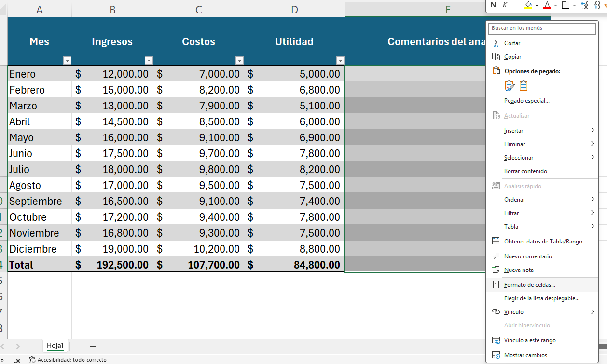
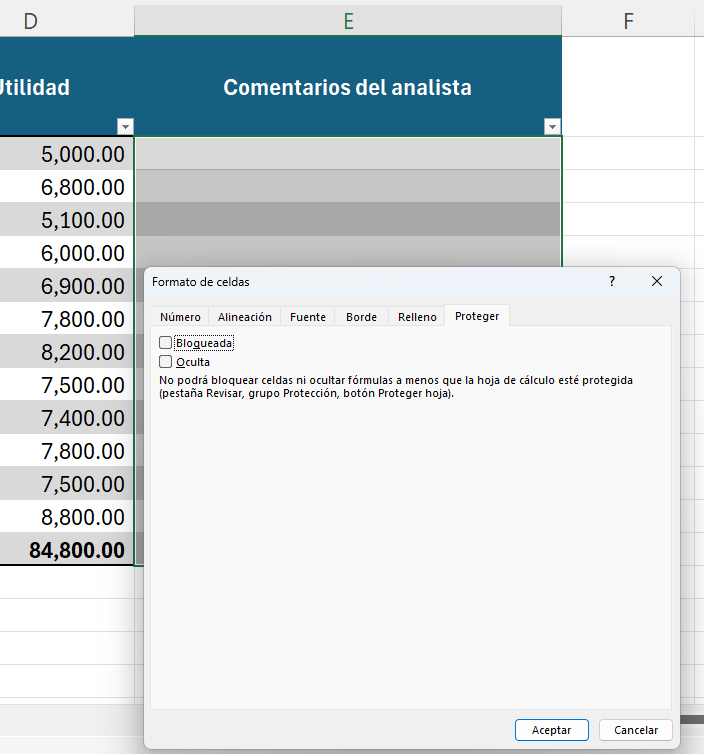
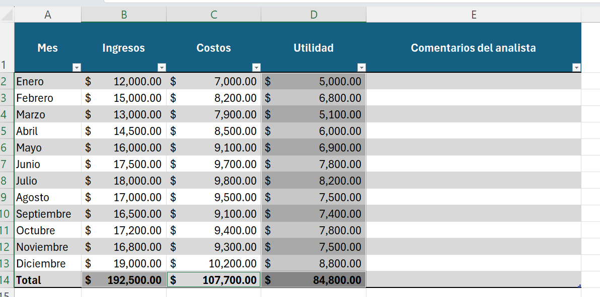
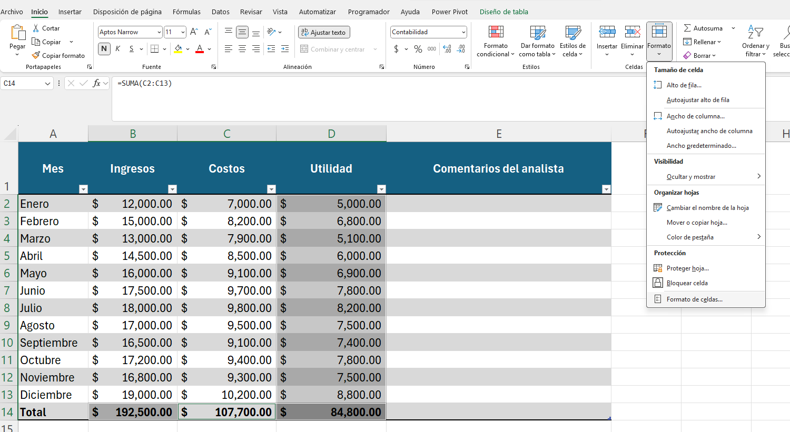
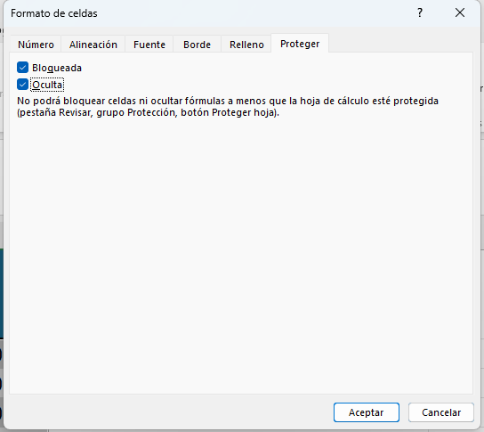
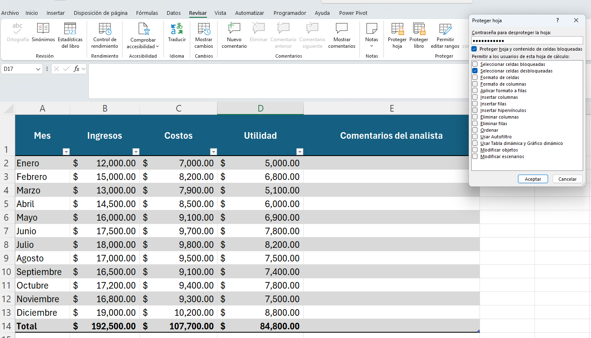
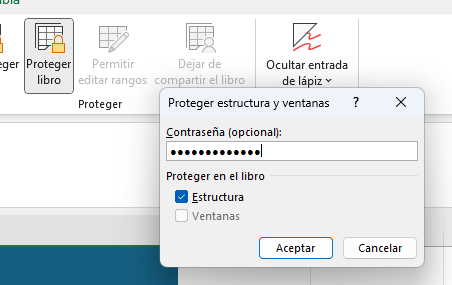
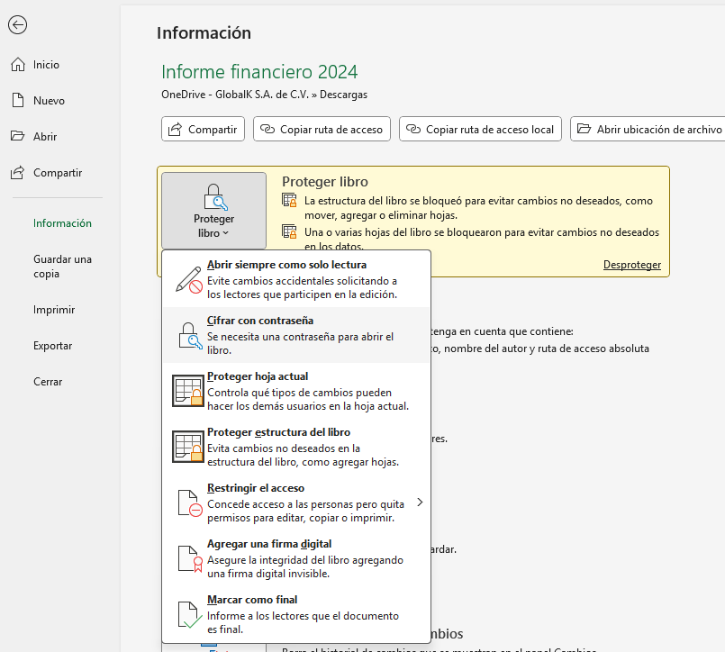
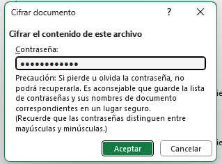
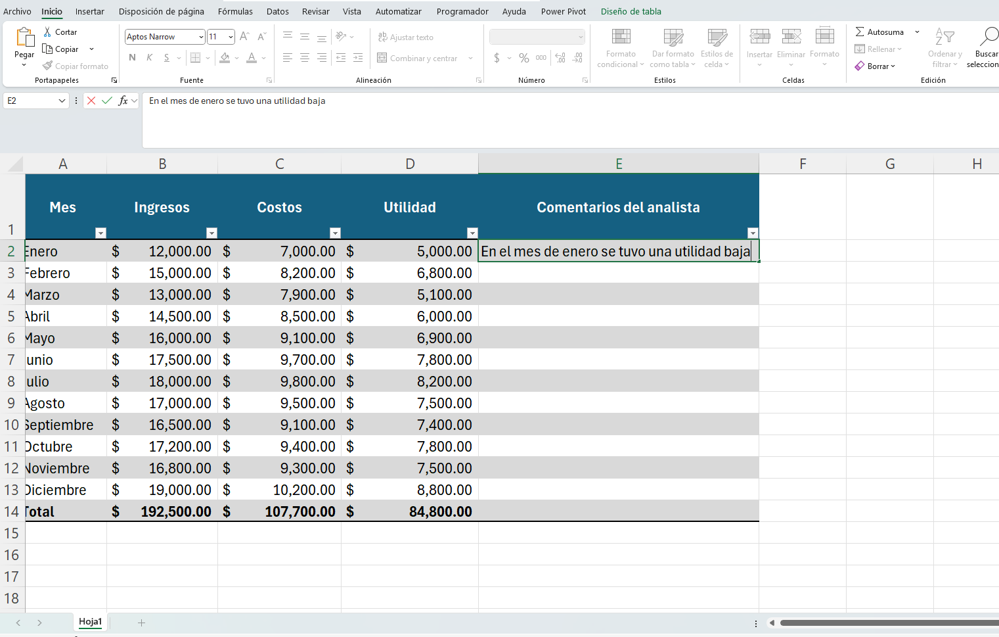

# Práctica 1. Control de acceso y protección de datos en un informe financiero

## 🎯 Objetivos:
Al finalizar la práctica, serás capaz de:
- Aplicar la protección de celdas específicas para evitar modificaciones no deseadas.
- Configurar contraseñas para restringir la apertura y edición del archivo.
- Bloquear la estructura del libro para impedir la manipulación de hojas.
- Ocultar fórmulas críticas que contienen cálculos financieros.
- Permitir la edición únicamente en las celdas designadas para entrada de datos.

## 🕒 Duración aproximada:
- 15 minutos.

---

**[Lista general 🗂️](https://netec-mx.github.io/EXL_ADV/)** | **[Siguiente ➡️](https://netec-mx.github.io/EXL_ADV/Cap%C3%ADtulo2/)**

---

## Instrucciones:
### Tarea 1. Preparar las celdas editables (comentarios).

Paso 1. Abre el archivo [Informe financiero 2024](<Informe financiero 2024.xlsx>). 

Selecciona el rango `$E2:E14$`.

Paso 2. Haz clic derecho en: Formato de celdas → Proteger → desmarca "Bloqueada".

Paso 3. Esto permite que solo esa columna sea editable.

### Tarea 2. Ocultar las fórmulas.

Paso 1. Selecciona las celdas con fórmulas: columna D y fila 14 (D2:D14, B14:D14).

Paso 2. Dirígete a: Inicio → Formato de celdas → Protección → Marca "Oculta".

### Tarea 3. Activar la protección de hoja.

Paso 1. Ve a: Revisar → Proteger hoja.

Paso 2. Marca únicamente “Seleccionar celdas desbloqueadas”.

Paso 3. Contraseña: `Resumen2024`.

### Tarea 4.  Proteger el libro (estructura).

Paso 1. Dirígete a: Revisar → Proteger libro.

Paso 2. Marca “Estructura” y asigna la contraseña: `EstructuraFin`.

### Tarea 5. Proteger con contraseña el archivo.

Paso 1. Ve a: Archivo → Información → Proteger libro → Cifrar con contraseña.

Paso 2. Contraseña: `Finanzas2024`.

### Tarea 6. Proteger con contraseña el archivo.

Paso 1. Dirígete a: Archivo → Información → Proteger libro → Cifrar con contraseña.

Paso 2. Contraseña: `Finanzas2024`.

Paso 3. Guarda los cambios y cierra el archivo.

Paso 4. Abre el archivo, ingresa la contraseña y coloca un comentario en la columna "Comentarios del analista".

### Resultado esperado:

- Solo se podrán ingresar comentarios en la columna “Comentarios del analista”.
- Las fórmulas estarán ocultas y protegidas.
- No se podrán insertar, eliminar o mover hojas.
- El archivo completo no podrá abrirse o editarse sin contraseña.

---

**[Lista general 🗂️](https://netec-mx.github.io/EXL_ADV/)** | **[Siguiente ➡️](https://netec-mx.github.io/EXL_ADV/Cap%C3%ADtulo2/)**

---
