# Laboratorio 3: Modelo de datos con Power Pivot ()

## Objetivo de la práctica:
Al finalizar la práctica, serás capaz de:
- Comprender el proceso de agregar y relacionar múltiples tablas en Power Pivot para crear un modelo de datos integrado.

- Aprender a usar Power Pivot para crear una tabla dinámica basada en datos relacionados de múltiples tablas.

## Duración aproximada:
- 10 minutos.

## Escenario:
Eres un analista de datos en una empresa que maneja grandes volúmenes de información sobre ventas, productos y tiendas. Recientemente, has notado que el manejo de estos datos en hojas de Excel individuales resulta lento y complicado. Por ello, decide usar Power Pivot para integrar y relacionar estas tablas, permitiendo un análisis más fluido y eficiente.

---

**[⬅️ Atrás](https://netec-mx.github.io/EXL_ADV/Cap%C3%ADtulo2/)** | **[Lista General](https://netec-mx.github.io/EXL_ADV/)** | **[Siguiente ➡️](https://netec-mx.github.io/EXL_ADV/Cap%C3%ADtulo4/)**

---

## Instrucciones 

### Tarea 1. Agregar tablas al modelo de datos

Paso 1. Descarga y guarda el siguiente archivo llamado: [Modelos_con_Power_Pivot](Modelos_con_Power_Pivot.xlsx) 

Paso 2. Dirígete a la pestaña Ventas, posteriormente en la barra superior selecciona Power Pivot y selecciona Agregar a modelo de datos 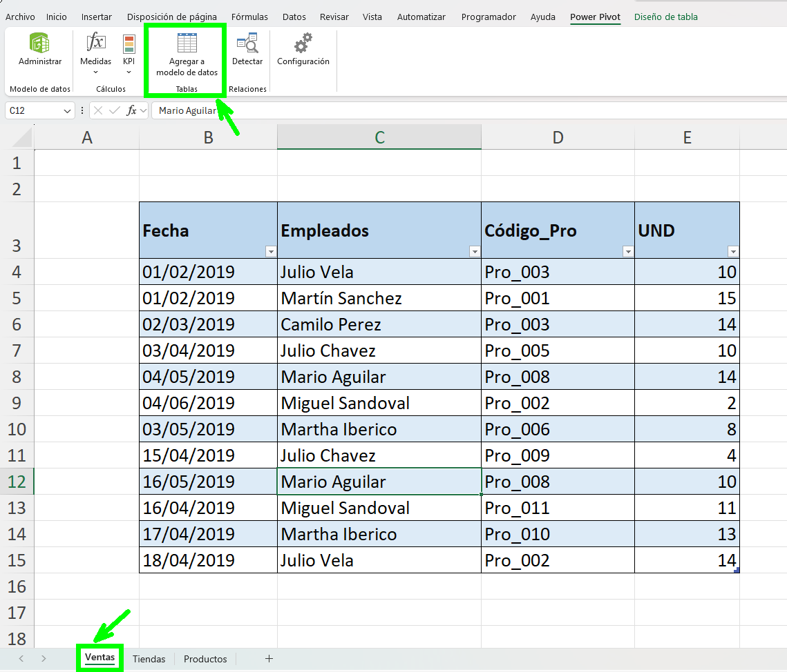

Verás que se despliega el editor de Power Pivot

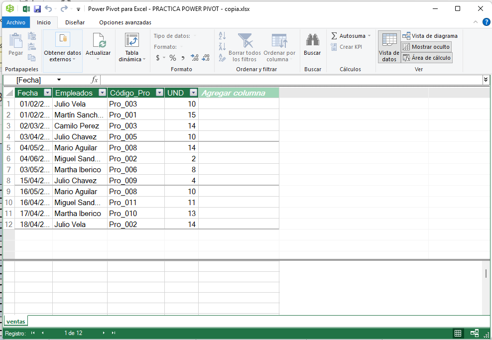

Paso 3. Minimizar la pantalla y hacer lo mismo con la pestaña de Tiendas y Productos
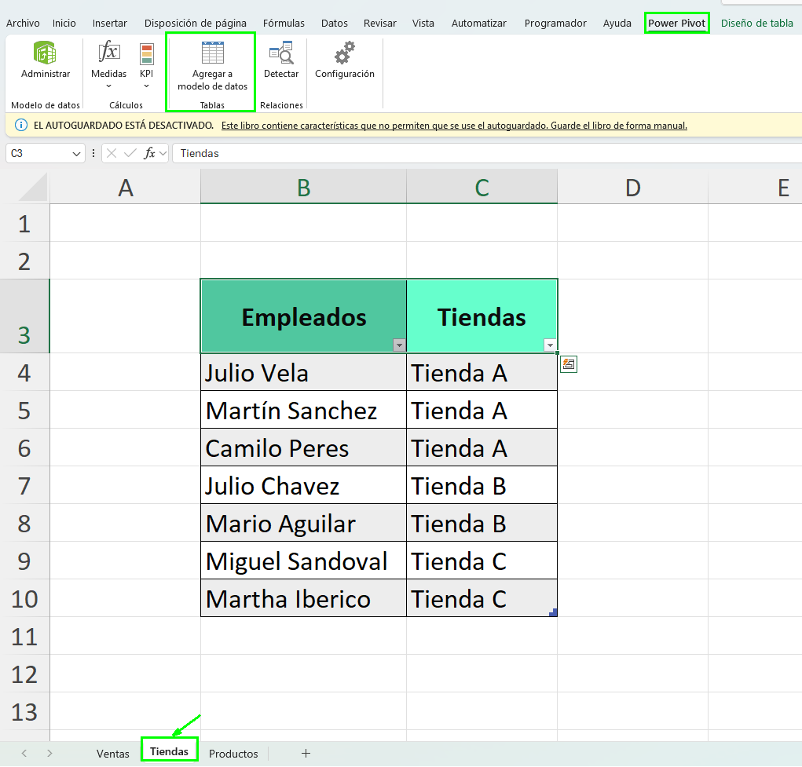

Veras en el editor de Power Pivot las tres pestañas de cada modelo de datos agregado.

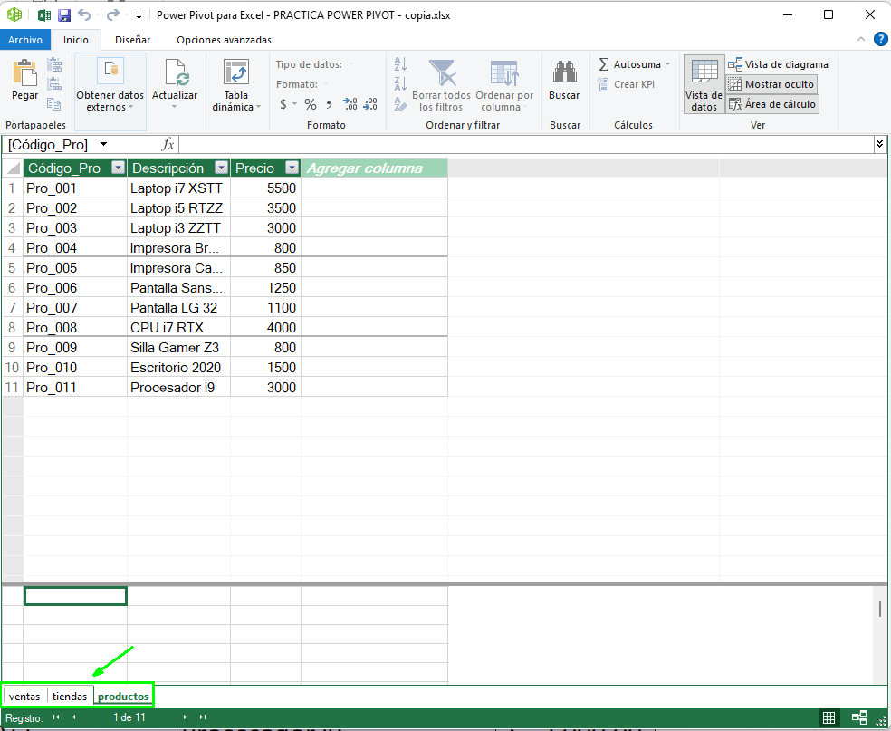

### Tarea 2. Relacionar las tablas en Power Pivot

Paso 1. Ir a la vista de diagrama:

* En la ventana de Power Pivot, haz clic en Vista de diagrama.
* Aparecerán las tres tablas cargadas con sus encabezados visibles

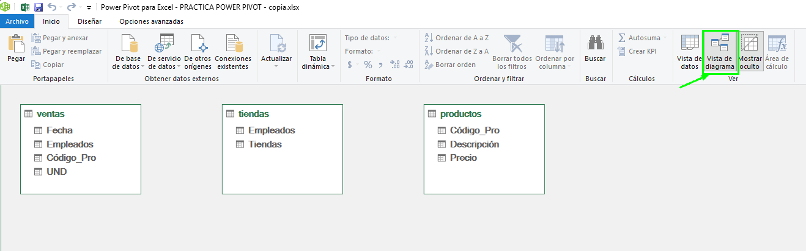

Paso 2. Relacionar la tabla de Ventas con la de Productos:
- Identifica la columna Código de Producto en ambas tablas.
- Arrastra la columna Código de Producto de la tabla de Ventas hacia la columna correspondiente en la tabla de Productos.

*Nota:* Considera que puedes arrastrar las tablas según tu preferencia.

Verifica que la relación se haya creado.

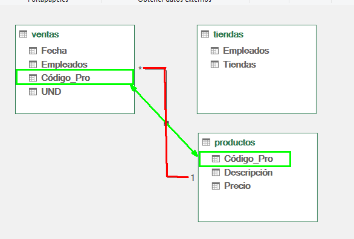

Paso 3. Relacionar la tabla de Ventas con la de Tiendas:
- Encuentra la columna Empleado en la tabla de Ventas y la columna Empleado en la tabla de Tiendas.
- Arrastra la columna Empleado de la tabla de Ventas hacia la columna en la tabla de Tiendas.

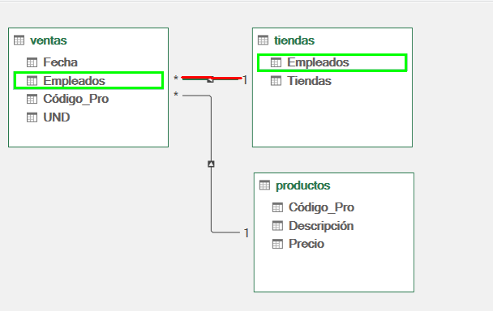

- Asegúrate de que la relación sea correcta.

### Tarea 3. Crear una tabla dinámica en Power Pivot

Paso 1. Insertar una tabla dinámica:
- En la ventana de Power Pivot y selecciona Tabla dinámica en la parte superior.

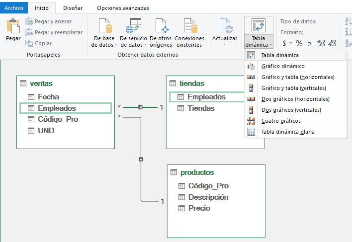

- Elige Nueva hoja de cálculo para que la tabla dinámica se inserte en una hoja nueva en Excel.

Paso 2. Agregar campos a la tabla dinámica:
- En la lista de campos de la tabla dinámica, selecciona Tienda de la tabla de Tiendas y colócala en el área de Filas.
- Agrega Descripción del Producto de la tabla de Productos al área de Filas debajo de Tienda.
Añade Unidades de la tabla de Ventas al área de Valores. 
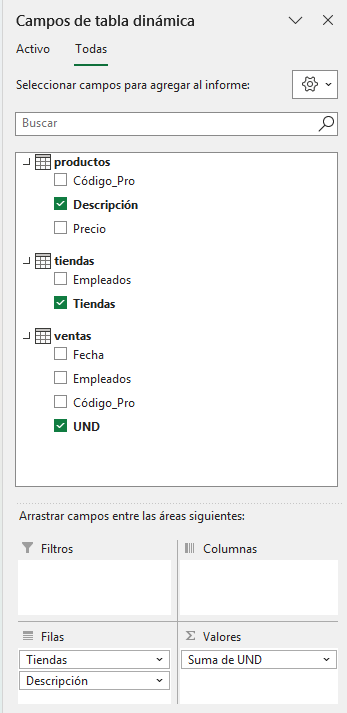

Paso 3. Guarda los cambios realizados y cierra el archivo.

### Resultado esperado

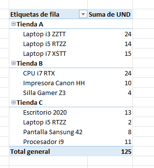

# Laboratorio 4: Filtrado Interactivo de Ventas con Segmentación en Power Pivot 

## Objetivo de la práctica:
Al finalizar la práctica, serás capaz de:

- Crear una tabla dinámica basada en el modelo de datos para analizar ventas de forma detallada por empleado y categoría de producto.

- Aplicar segmentaciones de datos para filtrar dinámicamente los resultados en la tabla dinámica, mejorando la interacción y el análisis visual.

## Duración aproximada:
- 10 minutos.

## Instrucciones 

### Tarea 1. Generar modelo de datos

Paso 1: Descarga el archivo llamado [Práctica_2_módulo_3](práctica_módulo_3_parte_2.xlsx)

Paso 2: En la pestaña "empleados" seleccionar la tabla , en la parte superior ir a power pivot y dar clic en agregar a modelo de datos.

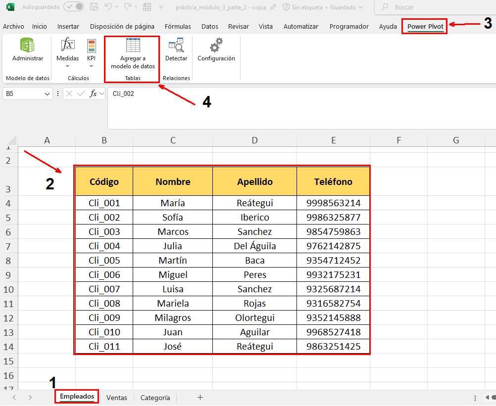

Confirmamos 

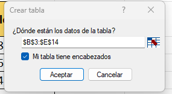

Paso 3. Cerrramos la hoja y repetimos lo mismo con cada una de las tablas de la pestaña "Ventas" y "Categoría"

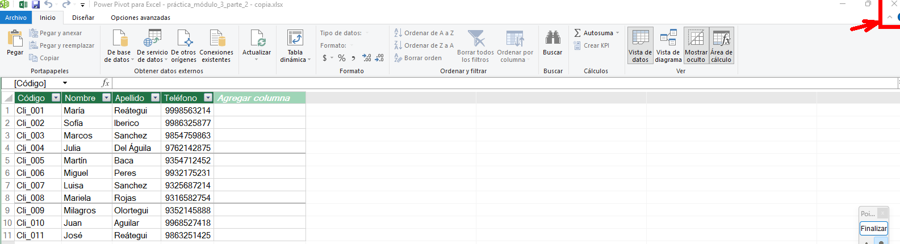

Paso 4. Una vez que ya está todas las tablas en power pivot, cambiamos los nombres de las tablas, dando clic derecho en la opción cambiar nombre.

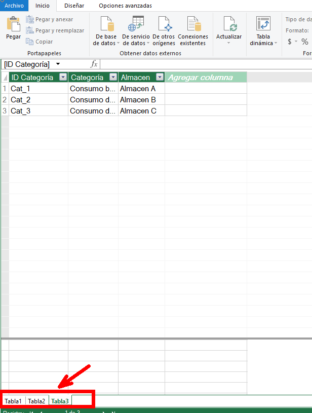

Los nombre deben quedar de la siguiente manera: 

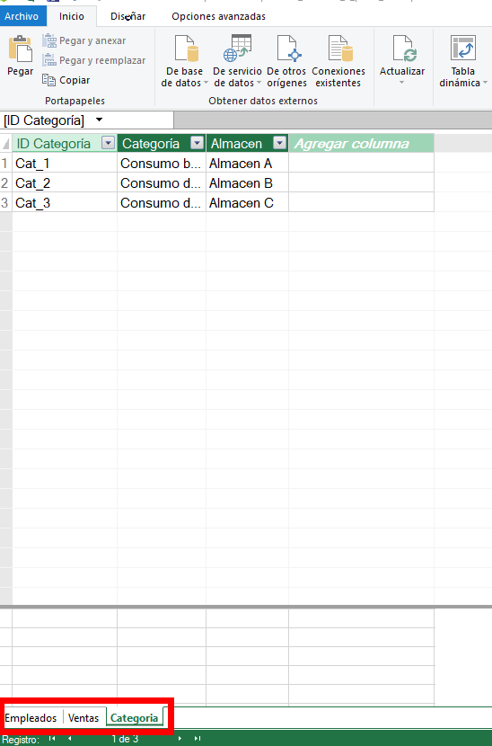

Paso 5. Vamos a la opción de vista de diagrama en Power Pivot.

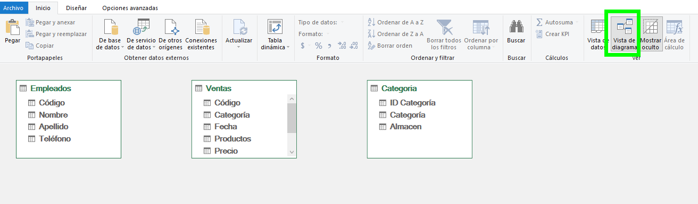

Paso 6. Creamos las relaciones de la siguiente manera: 
- Tabla empleados (código) va a unirse a tabla ventas (código)
- Tabla Ventas (categoría) va a unirse a tabla categoría (categoría)

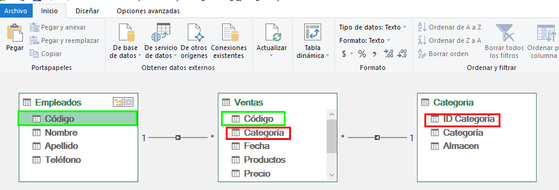

### Tarea 2. Crear tabla dinánmica

Paso 1. En la barra superior seleccionamos tabla dinámica

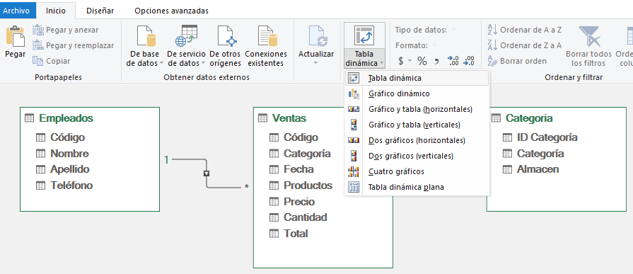

Paso 2. Selecciona una nuneva hoja de calculo.
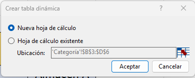

Paso 3. La tabla dinámica quedará en la columnas el campo de "Nombre" que está en la tabla empleados.
Las filas quedarán con el campo Fecha (de la tabla ventas), categoría( de la tabla categoría) y productos (de la tabla Ventas)

En valores quedará la suma del campo total que está en la tabla "Ventas"

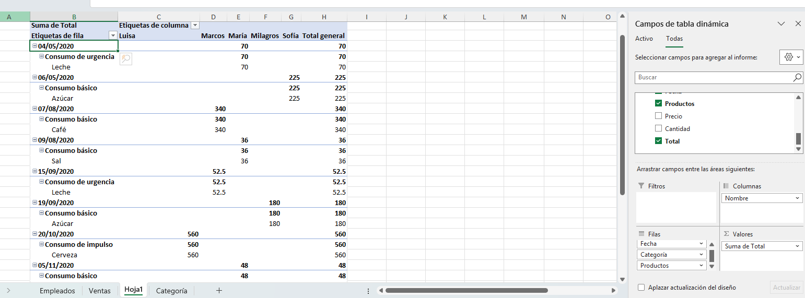

Paso 4. Vamos a la celda donde aparece la primera fecha que es 04/05/2020
damos clic derecho y seleccionamos agrupar.

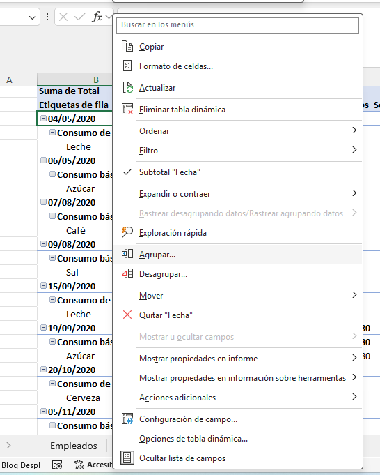

Seleccionamos la opción de meses y aceptar.

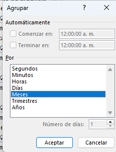

Paso 5. seleccionamos una celda de la columna del total general, clic derecho y vamos a formato número

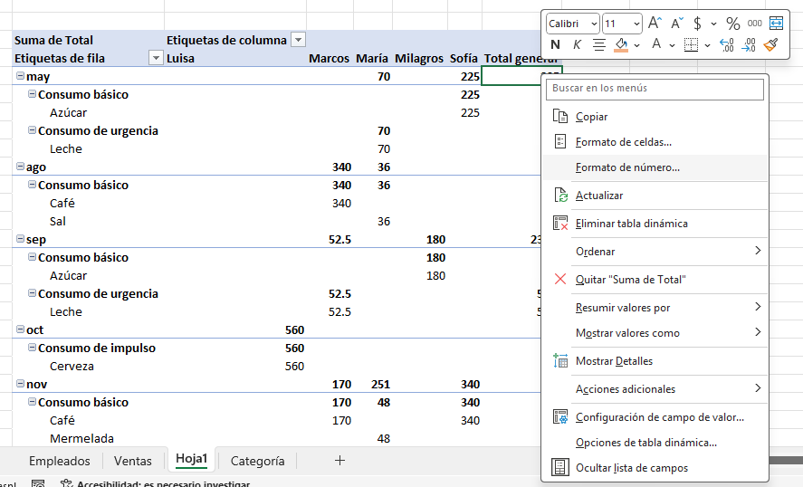

Pao 6. Seleccionamos el formato moneda y las posiciones decimales 0.
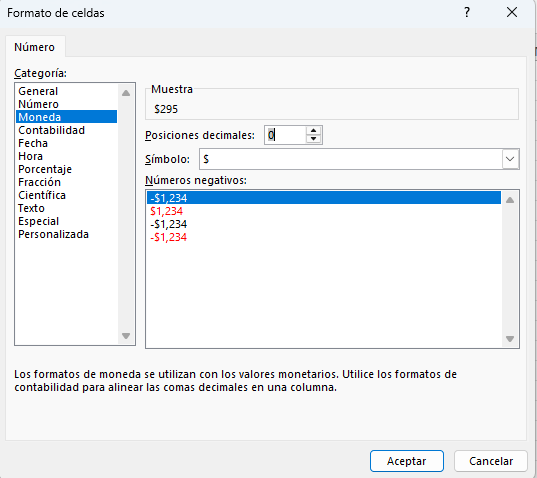

### Tarea 3. Insertar segmentadores

Paso 1. Nos posicionamos en la tabla dinámica y vamos a en la barra superiro a la opción de "Analizar tabla dinámica" y seleccionamos "Insertar segmentación de datos"
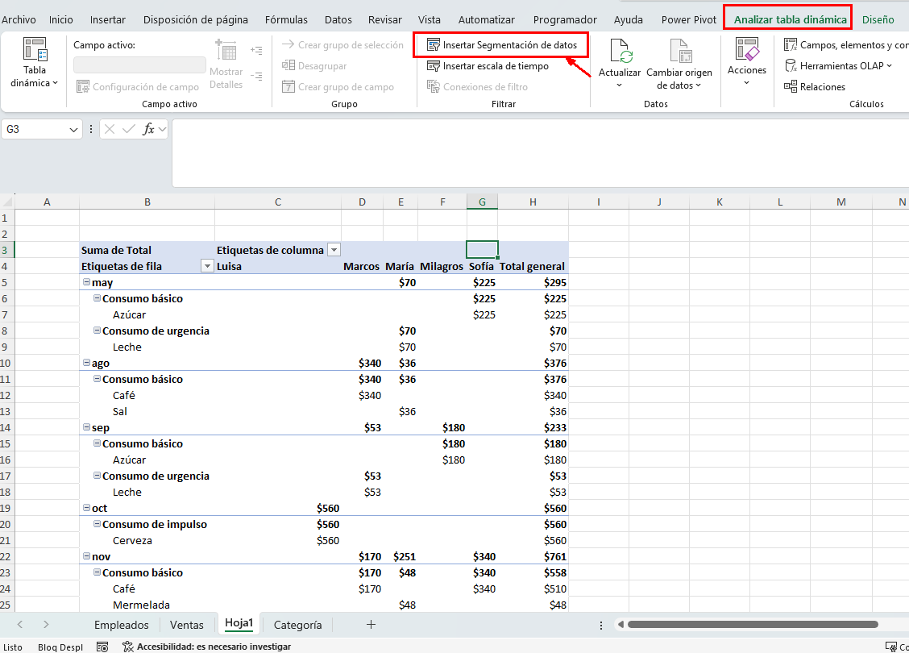

Paso 2. Vamos a seleccionar en la tabla categoría la opción categoría. Y en la tabla ventas seleccionamos productos.

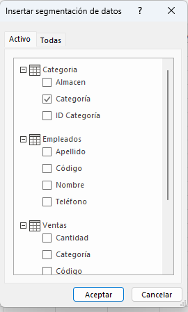

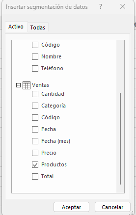

Paso 3. En los segmentadores insertados, seleccionamos "consumo básico" y "azúcar" y "café"

Paso 4: Guarda los cambios realizados y cierra el archivo.

*Nota:* Si deseas puedes cambiar el color de los segmentadores o de la tabla dinámica. Para esto hay que ir a la opción Diseño.
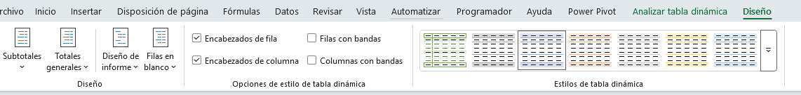
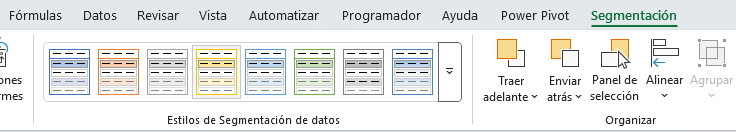

### Resultado esperado
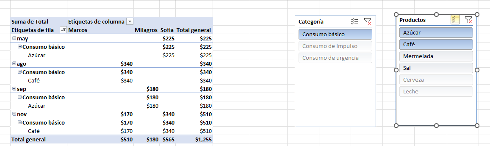

# Laboratorio 5: Evaluación de Ventas con KPIs en Power Pivot

## Objetivo de la práctica:
Al finalizar la práctica, serás capaz de:

- Integrar datos comerciales al modelo de Power Pivot.

-Crear una medida DAX que calcule el promedio de ventas por operación.

-Construir un KPI visual para evaluar el cumplimiento de metas de venta por producto.

-Analizar gráficamente los resultados mediante una tabla dinámica.

## Duración aproximada:
- 10 minutos.

## Escenario:
Trabajas en el área de inteligencia comercial de una empresa dedicada a la distribución de tecnología, mobiliario y telecomunicaciones a nivel nacional. Cada venta tiene un valor considerable, ya que se trata de productos empresariales.

La gerencia solicita un informe visual que indique qué productos están cumpliendo con el objetivo de ventas promedio por operación, fijado en $6,000 MXN.

Para ello, vas a construir un KPI con Power Pivot, el cual te permitirá visualizar este rendimiento con indicadores de color.

## Instrucciones 

### Tarea 1.Cargar los datos al modelo de Power Pivot

Paso 1. Descargar y abrir el archivo [Práctica_módulo_3_ parte_3](práctica_módulo3_parte_3.xlsx)

Paso 2. Convierte los datos en una tabla (Crtl + T) y nombrala VentasKPI

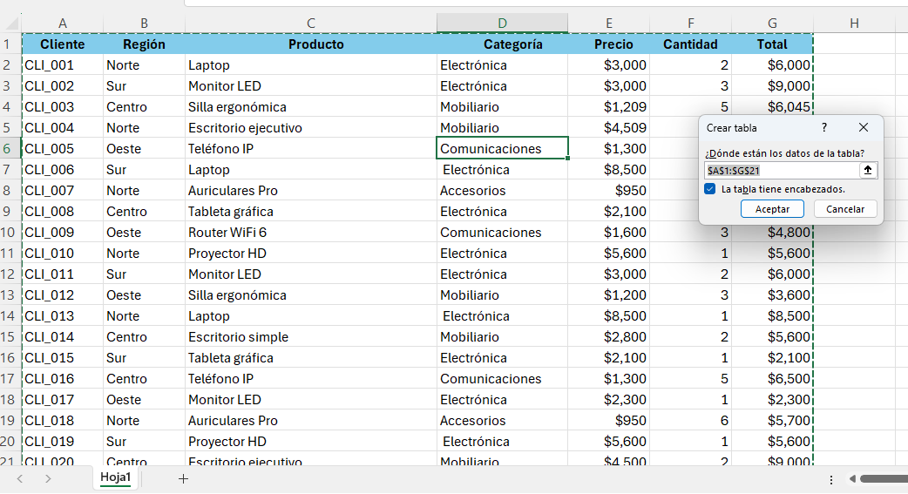
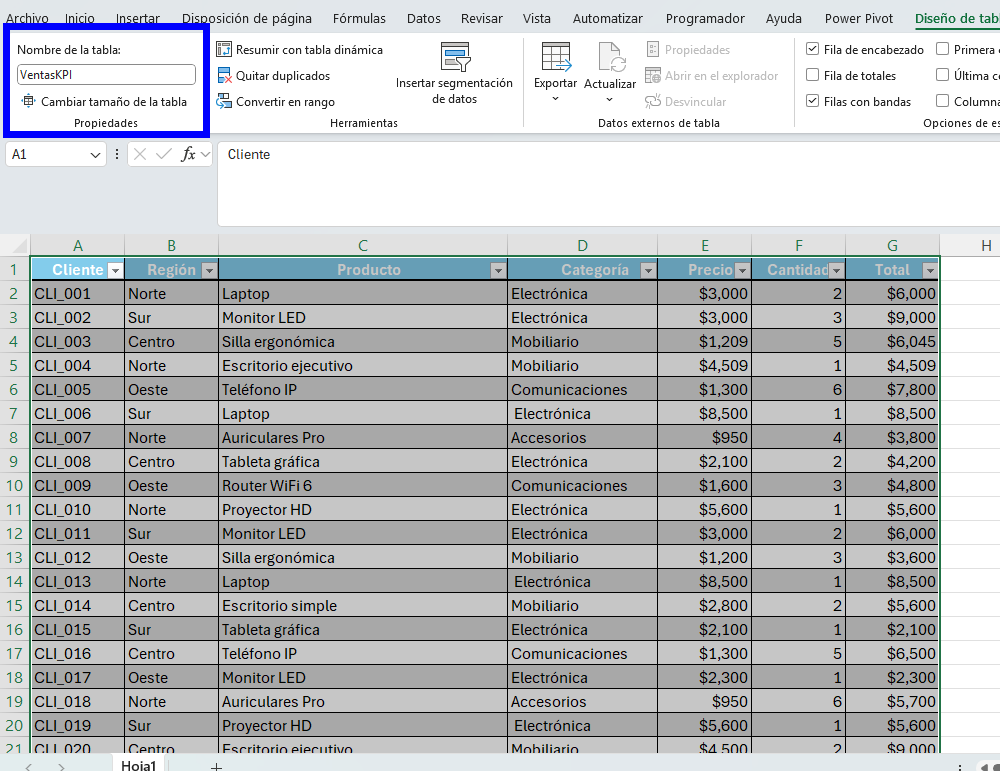

Paso 3. Ve a la pestaña Power Pivot > Agregar al modelo de datos.

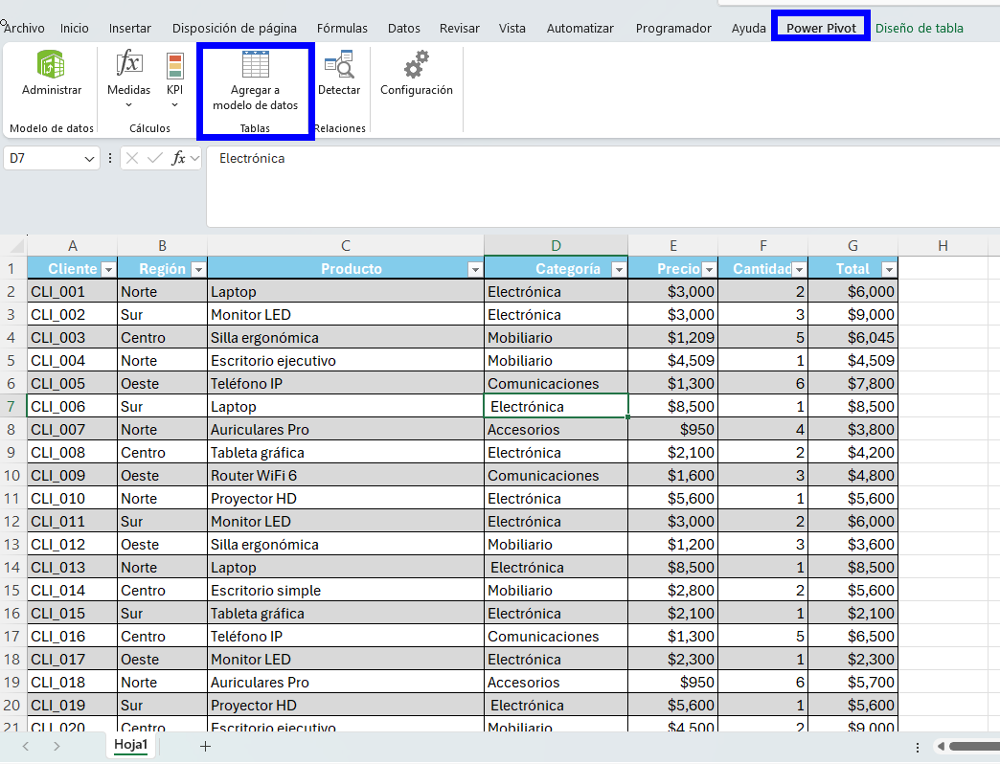

### Tarea 2.Crear una medida de Promedio de Venta

Paso 1. Da formato de moneda a la columna Precio y columna Total

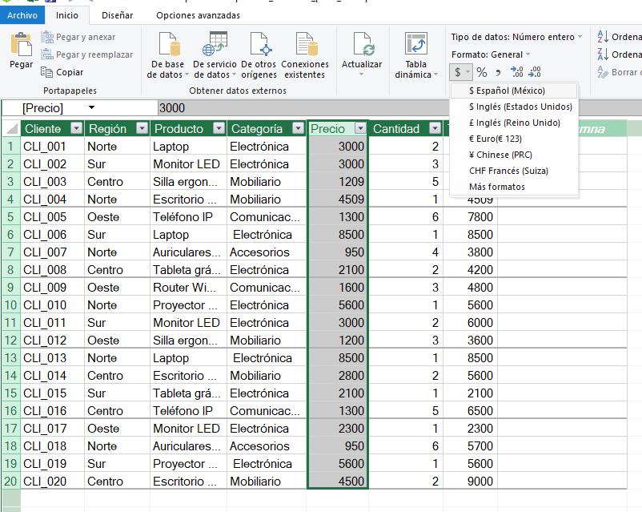

Paso 2. En el área de cálculo, crea una medida con la siguiente formula :

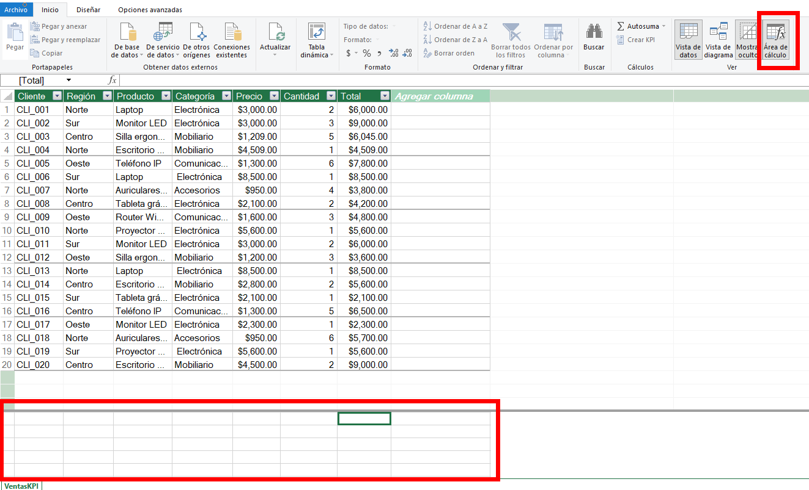

*PromedioVenta := AVERAGE(VentasKPI[Total])*

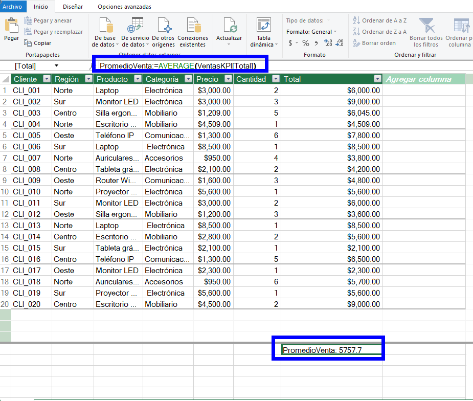

Paso 3. Dale formato al promedio de venta, dar clic derecho, opción formato. Seleccionar Moneda, simbolo $ y posiciones decimales 1.

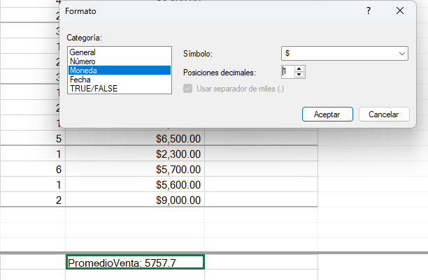

### Tarea 3.Crear el KPI

Paso 1. Selecciona la medida de PromedioVenta
Paso 2. Haz clic en "Crear KPI" en la pestaña de Inicio de Power Pivot
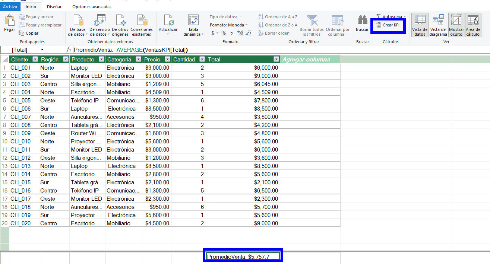

Paso 3. Configura el KPI así:

Valor objetivo absoluto: 6000

Indicadores de estado:

🔴 Rojo si < 4000

🟡 Amarillo si entre 4000 y 6000

🟢 Verde si > 6000

Paso 4. Confirma con Aceptar

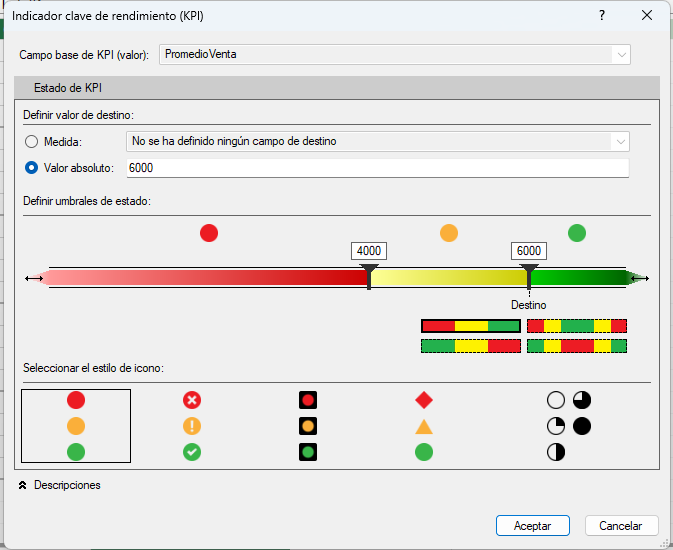

### Tarea 34.  Crear una tabla dinámica para visualizar

Paso 1. Regresa a tu hoja de excel donde esta la tabla  y selecciona la opción de insertar tabla dinámica, selecciona la opción de "Desde modelo de datos" y en una nueva hoja 

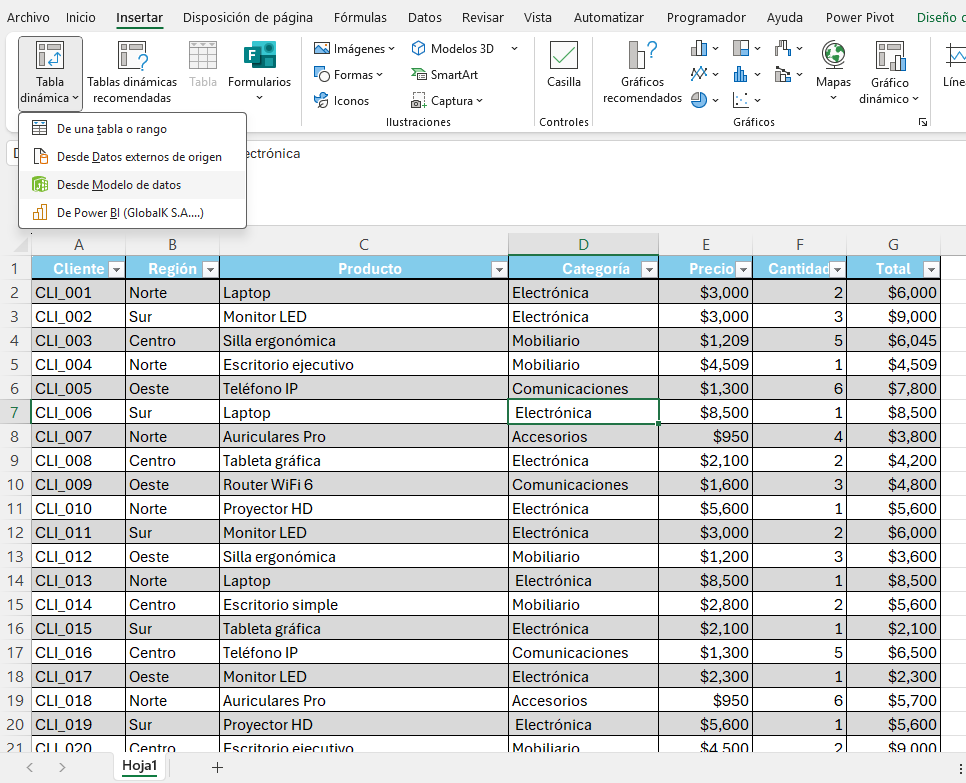

Paso 2. En la tabla dinámica:

- Agrega Producto a Filas.

- Agrega a Valores:

    - Promedio de venta

    - Estado del KPI (el icono visual)

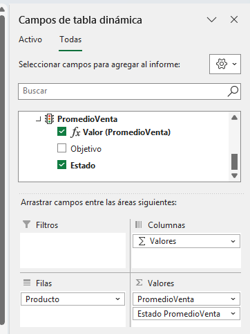

Paso 3. Guardamos los cambios y cerramos el libro.

### Resultado esperado
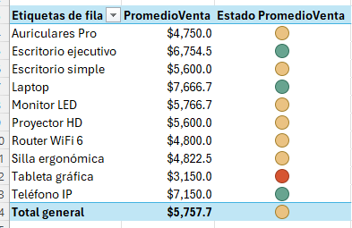

# Laboratorio 7: Segmentación Inteligente de Clientes con Power Query

## Objetivo de la práctica:
Al finalizar la práctica, serás capaz de:
- Importar correctamente un archivo CSV.

- Corregir y confirmar el tipo de datos de cada columna.

- Aplicar una columna personalizada con una clasificación más avanzada.

- Cargar el resultado limpio a Excel.

## Duración aproximada:
- 10 minutos.

## Escenario: 
Tú formas parte del equipo de análisis comercial de una cadena de tiendas a nivel nacional.
El departamento de ventas ha generado un archivo con información detallada de compras de clientes durante el primer trimestre del año. Tu tarea consiste en limpiar los datos y clasificar a los clientes según su nivel de compra, para identificar perfiles de consumo y preparar futuras campañas de marketing segmentado.

Este análisis permitirá detectar:

Clientes de alto valor (VIP) que merecen atención especial.

Clientes promedio (Premium y Regular).

Clientes con bajo nivel de compra (Básico) para estrategias de retención.

## Instrucciones 

### Tarea 1. Importar el archivo CSV en Power Query
Paso 1. Descarga el archivo llamado [BD_Clientes](BD_Clientes_Power_Query.csv)
Paso 2. Abre un libro de excel, guardalo con el nombre de "Práctica módulo 4"

Paso 3. Vamos a Excel → Datos > Obtener datos > Desde archivo > Desde texto/CSV
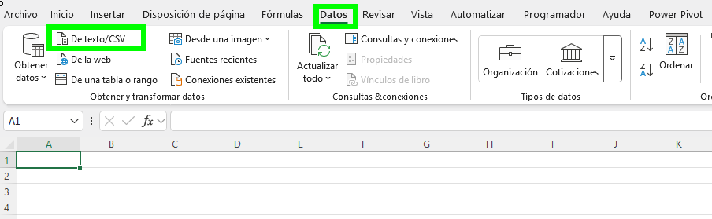

Paso 4. Seleccina el archivo CSV que descargaste, e importamos.
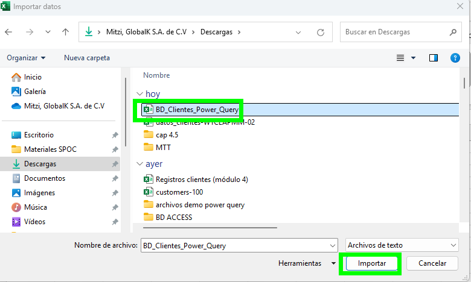

Paso 5. Seleccionamos la opción de "Transformar datos"
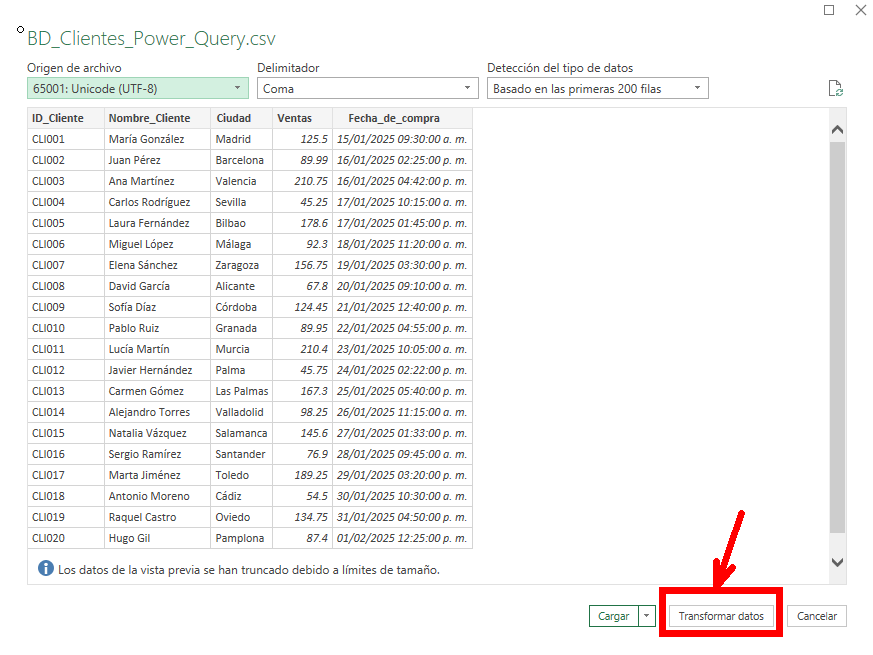

### Tarea 2. Verificar y corregir tipos de datos

Paso 1. Revisar que la columna "ID_Cliente", "Nombre_Cliente" y "Ciudad" esten en formato Texto.

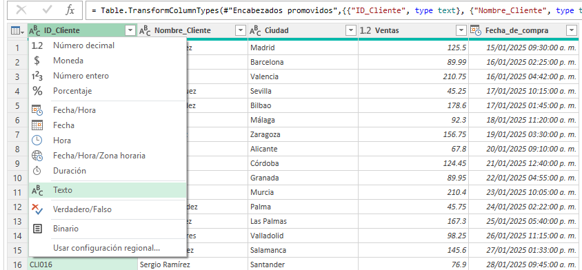

Paso 2. Revisar que la columna "Ventas" este en formato: "Número decimal" 

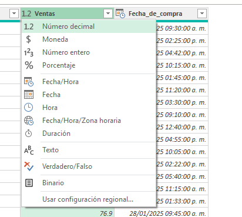

Paso 3.Revisar que "Fecha_de_compra" este en formato : Fecha/Hora (si aparece como texto cambialo a fecha)

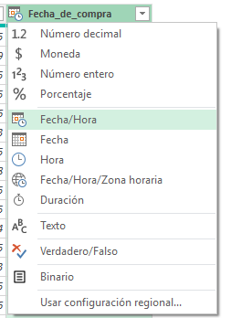

### Tarea 3. Crear columna personalizada (clasificación avanzada)

Paso 1. Ve a Agregar columna > Columna personalizada
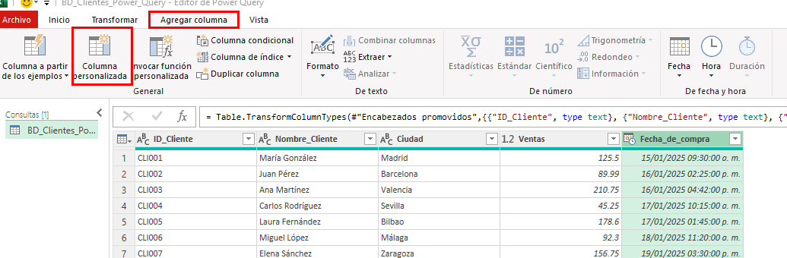

Paso 2. Nombrala "Clasificación_Cliente"

Usa está fórmula en lenguaje M: 

if [Ventas] >= 200 then "🔝 VIP"
else if [Ventas] >= 150 then "⭐ Premium"
else if [Ventas] >= 100 then "✔️ Regular"
else "📉 Básico"

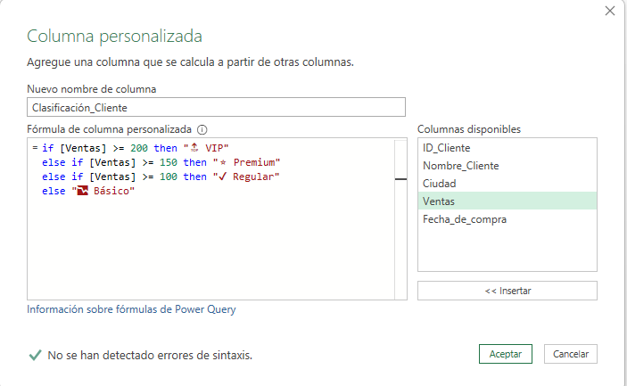

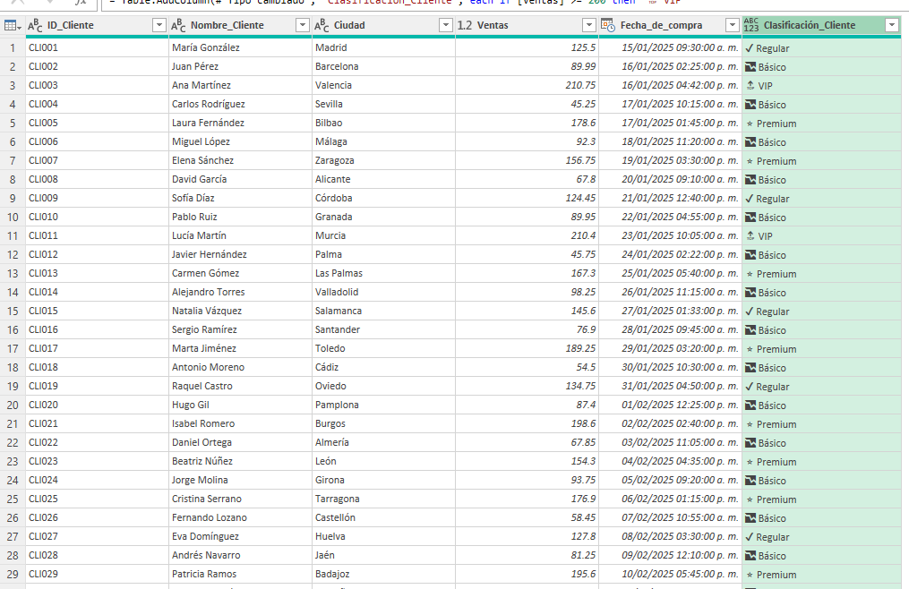

### Tarea 4. Renombrar columnas

Paso 1. Para mayor claridad renombrar la columna "Fecha_de_compra" por "Fecha"
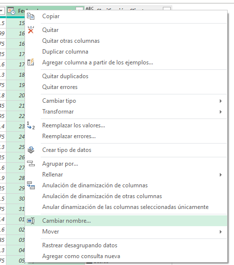

Paso 2. Hacemos lo mismo para la columna "Nombre_Cliente", damos clic derecho posicionados sobre la columna.

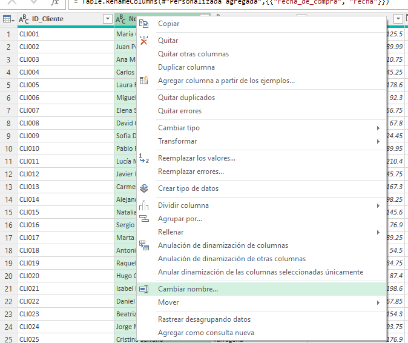

### Tarea 5. Cargar datos a excel

Paso 1. Haz clic en inicio y selecciona Cerrar y cargar

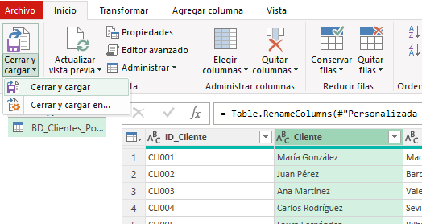

Paso 2. Guarda los cambios realizados y cierra el archivo.

### Resultado esperado

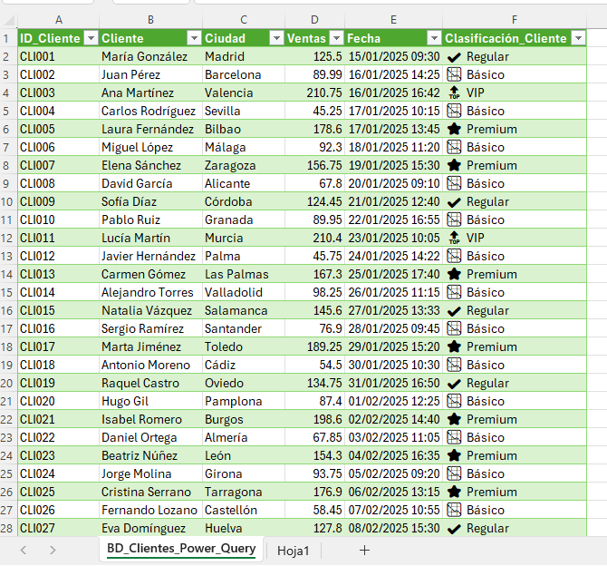
