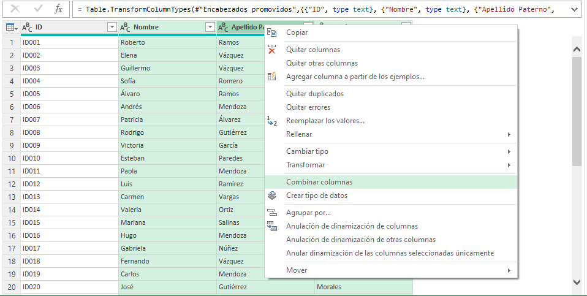
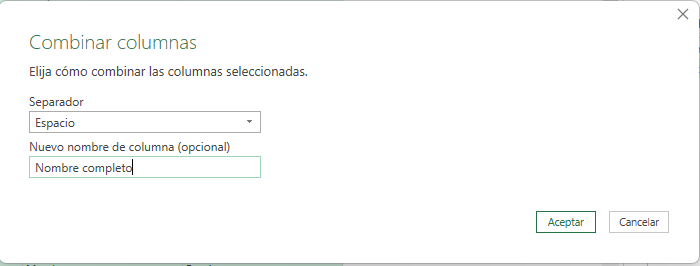
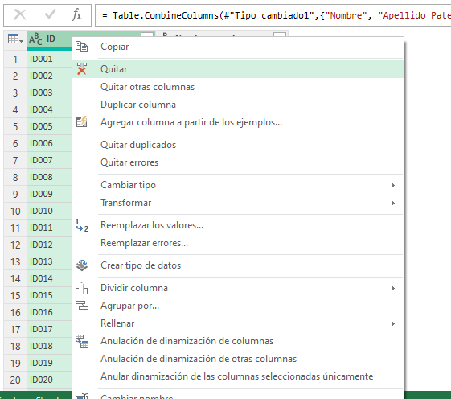
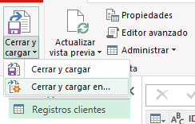
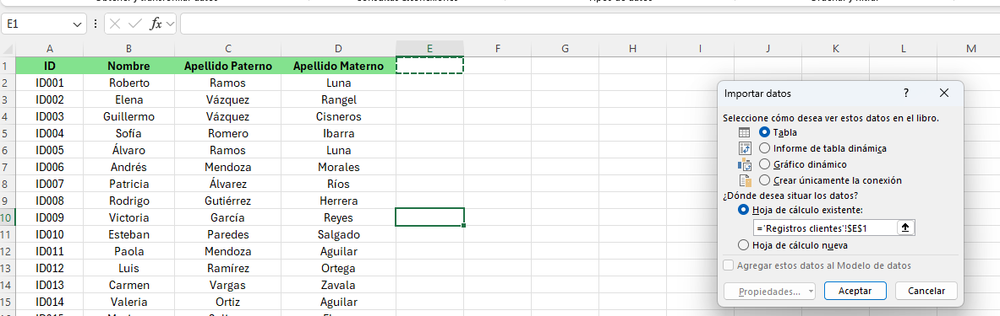
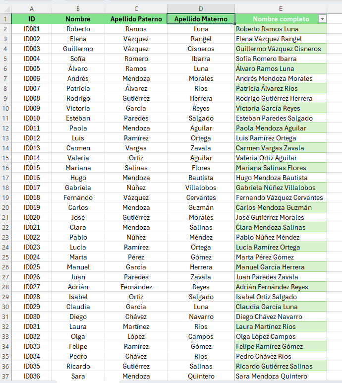
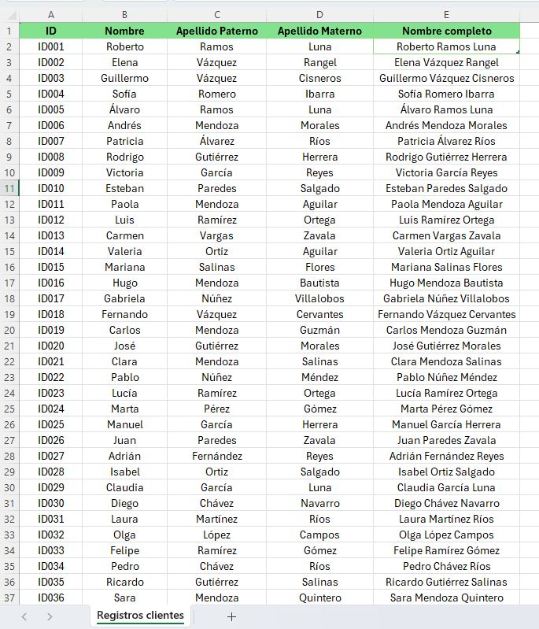

<<<<<<< HEAD
# Unificación de nombres en una celda utilizando Power Query.

---

**[⬅️ Atrás](https://netec-mx.github.io/EXL_ADV/Cap%C3%ADtulo3/)** | **[Lista General](https://netec-mx.github.io/EXL_ADV/)** | **[Siguiente ➡️](https://netec-mx.github.io/EXL_ADV/Cap%C3%ADtulo5/)**

---

=======
# Ejercicio 1. Actualización de direcciones de correo electrónico con Relleno Rápido.
>>>>>>> a33f170 (Mis cambios en main)

## Descargar el archivo llamado: [Ejercicio_correo_electrónico](Ejercicio_correo_electrónico.xlsx) 
Seguir las instrucciones del instructor para la resolución.

# Ejercicio 2. Optimización de Datos con Flash Fill en Excel

<<<<<<< HEAD
## Escenario:
Tienes una base de datos de clientes donde los campos Nombre, Apellido Paterno y Apellido Materno están separados en distintas columnas. Sin embargo, para algunos informes, necesitas consolidar el nombre completo de cada cliente en una sola celda. En lugar de hacerlo manualmente, utilizarás Power Query para automatizar este proceso, combinando estos campos en una nueva columna llamada Nombre Completo.
=======
## Descargar el archivo llamado:  [Optimización de Datos con Flash Fill](<Ejercicio_optimización de Datos.xlsx>)
Seguir las instrucciones del instructor para la resolución.

# Ejercicio 3. Unificación de Nombres y Manipulación de Direcciones

## Descargar el archivo llamado:  [Unificación de nombres](Unificación_de_nombres.xlsx)
Seguir las instrucciones del instructor para la resolución.
>>>>>>> a33f170 (Mis cambios en main)

# Ejercicio 4. Inventario creciente.
## Descargar el archivo llamado: [relleno_y_series](<Relleno y series Ejercicio 4 a 6 (1).xlsx>)

<<<<<<< HEAD
## Instrucciones 

### Tarea 1. Cargar los datos

Paso 1. Descarga y guarda el siguiente archivo llamado:  [Registro clientes](<Registros clientes (módulo 4).csv>)
el cual está en formato csv.

Podrás observar las columnas separadas de Nombre, Apellido Paterno y Apellido Materno.

Paso 2.  Dirígete a la pestaña Datos > Obtener datos > Desde archivo > De texto/CSV.
=======
Paso 1. Ir a la hoja inventario y seguir las instrucciones del instructor para la resolución.

# Ejercicio 5. Crecimiento de visitas a un sitio web
## Descargar el archivo llamado: [relleno_y_series](<Relleno y series Ejercicio 4 a 6 (1).xlsx>)

Paso 1. Ir a la hoja Proyecciones y seguir las instrucciones del instructor para la resolución.

# Ejercicio 6. Calendario de reuniones trimestrales

## Descargar el archivo llamado: [relleno_y_series](<Relleno y series Ejercicio 4 a 6 (1).xlsx>)
>>>>>>> a33f170 (Mis cambios en main)

Paso 1. Ir a la hoja Reuniones trimestrales.
Paso 2. Seguir las instrucciones del instructor para la resolución.

<<<<<<< HEAD
Paso 3. Selecciona el archivo Registro Clientes, el cual contiene los nombres, apellidos paternos y maternos.

Paso 4. En el panel del Navegador, selecciona la tabla que contiene estos datos y haz clic en Transformar datos para abrir el editor de Power Query.
=======

# Ejercicio 7. Proyección de crecimiento geométrico 
## Descargar el archivo llamado: [Previsiones_ventas](Previsiones_Ventas-ejercicio.xlsx)
Seguir las instrucciones del instructor para la resolución.
>>>>>>> a33f170 (Mis cambios en main)

# Ejercicio 8. Validación de datos con mensaje de error personalizado
## Descargar el archivo llamado: [Inscripción_escuela_esqui](Inscripcion_Escuela_Esqui.xlsx)
Seguir las instrucciones del instructor para la resolución.

# Ejercicio 9. Asigna empleados usando listas desplegables
## Descargar el archivo llamado: [Asignación de empleados](Asignación_empleados.xlsx)
Seguir las instrucciones del instructor para la resolución.

<<<<<<< HEAD
Paso 1. En el editor de Power Query, haz clic en el cuadro izquierdo que aparece a lado de la Column1 y selecciona la opción de Usar la primera fila como encabezado.
=======
# Ejercicio 10. Limpia tu base de datos eliminando duplicados 
## Descargar el archivo llamado: [Clientes_duplicados](<Clientes_Duplicados_Ejercicio (2).xlsx>)
Seguir las instrucciones del instructor para la resolución
>>>>>>> a33f170 (Mis cambios en main)

# Ejercicio 11. Subtotales en Excel: Ventas por Vendedor
## Descargar el archivo llamado: [Ventas_subtotales](Ventas_Subtotales_Ejercicio.xlsx)
Seguir las instrucciones del instructor para la resolución

# Ejercicio 12. Subtotales por Ubicación en el Mercado de Agricultores
## Descargar el archivo llamado: [Mercado_agricultores](Mercado_Agricultores.xlsx)
Seguir las instrucciones del instructor para la resolución

# Ejercicio 13. Generación de códigos aleatorios para taquillas 
## Descargar el archivo llamado: [Taquillas_fidelización](Taquillas_Fidelización.xlsx)
Paso 1. Ir a la hoja Taquillas
Paso 2. Seguir las instrucciones del instructor para la resolución.

<<<<<<< HEAD

Paso 3.  Da clic derecho y selecciona Combinar columnas.

Paso 4. Elige como separador la opción de Espacio y, en Nuevo nombre de columna, escribe: *Nombre completo*

Paso 5. Selecciona la columa ID, da clic derecho y remuévela.

Paso 6. Selecciona la columna Nombre completo y da clic en Cerrar y cargar en.

Paso 7. Deja marcado la opción Tabla; adicionalemente, marca la opción de Hoja de cálculo existente, selecciona la celda E1 y da clic en Aceptar.

Paso 8. Como resultado, obtendrás la nueva columna de nombre completo, únicamente dale el mismo formato que la tabla original.

Paso 9. Guarda los cambios y cierra el archivo.

### Resultado esperado

# Segmentación Inteligente de Clientes con Power Query

## Objetivo de la práctica:
Al finalizar la práctica, serás capaz de:
- Importar correctamente un archivo CSV.

- Corregir y confirmar el tipo de datos de cada columna.

- Aplicar una columna personalizada con una clasificación más avanzada.

- Cargar el resultado limpio a Excel.

## Duración aproximada:
- 15 minutos.

## Escenario: 
Tú formas parte del equipo de análisis comercial de una cadena de tiendas a nivel nacional.
El departamento de ventas ha generado un archivo con información detallada de compras de clientes durante el primer trimestre del año. Tu tarea consiste en limpiar los datos y clasificar a los clientes según su nivel de compra, para identificar perfiles de consumo y preparar futuras campañas de marketing segmentado.

Este análisis permitirá detectar:

Clientes de alto valor (VIP) que merecen atención especial.

Clientes promedio (Premium y Regular).

Clientes con bajo nivel de compra (Básico) para estrategias de retención.

## Instrucciones 

### Tarea 1. Importar el archivo CSV en Power Query
Paso 1. Descarga el archivo llamado [BD_Clientes](BD_Clientes_Power_Query.csv)
Paso 2. Abre un libro de excel, guardalo con el nombre de "Práctica módulo 4"

Paso 3. Vamos a Excel → Datos > Obtener datos > Desde archivo > Desde texto/CSV

Paso 4. Seleccina el archivo CSV que descargaste, e importamos.

Paso 5. Seleccionamos la opción de "Transformar datos"

### Tarea 2. Verificar y corregir tipos de datos

Paso 1. Revisar que la columna "ID_Cliente", "Nombre_Cliente" y "Ciudad" esten en formato Texto.

Paso 2. Revisar que la columna "Ventas" este en formato: "Número decimal" 

Paso 3.Revisar que "Fecha_de_compra" este en formato : Fecha/Hora (si aparece como texto cambialo a fecha)

### Tarea 3. Crear columna personalizada (clasificación avanzada)

Paso 1. Ve a Agregar columna > Columna personalizada

Paso 2. Nombrala "Clasificación_Cliente"

Usa está fórmula en lenguaje M: 

if [Ventas] >= 200 then "🔝 VIP"
else if [Ventas] >= 150 then "⭐ Premium"
else if [Ventas] >= 100 then "✔️ Regular"
else "📉 Básico"

### Tarea 4. Renombrar columnas

Paso 1. Para mayor claridad renombrar la columna "Fecha_de_compra" por "Fecha"

Paso 2. Hacemos lo mismo para la columna "Nombre_Cliente", damos clic derecho posicionados sobre la columna.

### Tarea 5. Cargar datos a excel

Paso 1. Haz clic en inicio y selecciona Cerrar y cargar

Paso 2. Guarda los cambios realizados y cierra el archivo.

### Resultado esperado

=======
# Ejercicio 14. Tarjetas de regalo aleatorias
## Descargar el archivo llamado: [Taquillas_fidelización](Taquillas_Fidelización.xlsx)
Paso 1. Ir a la hoja Fidelización
Paso 2. Seguir las instrucciones del instructor para la resolución.
>>>>>>> a33f170 (Mis cambios en main)

---

**[⬅️ Atrás](https://netec-mx.github.io/EXL_ADV/Cap%C3%ADtulo3/)** | **[Lista General](https://netec-mx.github.io/EXL_ADV/)** | **[Siguiente ➡️](https://netec-mx.github.io/EXL_ADV/Cap%C3%ADtulo5/)**

---
